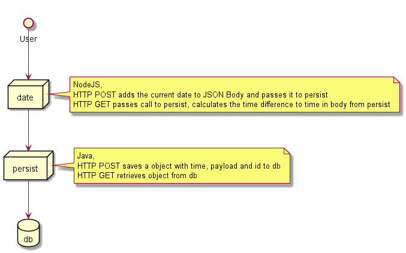

# How to interact with K8s as a developer
* Developing for K8S includes more than just code
* https://github.com/GoogleContainerTools/skaffold can help with that

---

# ~$whoami
* Christian Scheer
* Software Developer at T-Systems MMS
* christian.scheer@t-systems.com

---

## Stateless apps are great. 
### But

Unless you are developing a static website, you either need another service as a dependency or storage for some state
* Other HTTP/gRPC Service
* Databases
* Message Brokers
* etc.

---

* As long as your application as a whole is small, it is feasible to run everything on your laptop. 
* At some point, this does not work anymore.

---

## A Bad option
Running everything on your laptop
* run every needed service outside in your IDE or your local machine

bad!
* if an application service is developed with kubernetes in mind
  * you need to build around configuration 
  * you need to build around configuration service discovery

---

## Another Bad option
run everything in docker-compose except the service you are working on.
* service discovery/dns is solved for all service inside docker.
* your service outside of it still need to be reconfigured
* other services using your service cannot reach it
* if your're using the kubernetes api, docker-compose does not work at all

---

## Another Bad option
run everything in local k8s except the service you are working on
* service discovery/dns is solved for all service inside docker
* your service outside of it still need to be reconfigured
* other services using your service cannot reach it

---

## there is a way!
skafold!
* run all services inside k8s, even the one you are working on.
* Use local Cluster (Minikube, Docker for Windows, ...) or a remote Cluster
* https://skaffold.dev/docs/

---

## Demo Application


---

## Demo Details
* local K8s (Docker for Windows)
  * this is not recommended, but i ran out of time :)
* Namespace "development" contains development branch
* You want to develop a feature in one service

---

## Demo
POST
```
curl -XPOST localhost:3000 \
-H "Content-Type: application/json" \
-d '{"id":"49d4fe29-afd3-4fb6-95fc-75632f327c4c",
     "payload":"Hello Cloud Native"}'
```
GET
```
curl localhost:3000/49d4fe29-afd3-4fb6-95fc-75632f327c4c
```

---

## Demo
```
curl -XPOST localhost:8080 \
-H "Content-Type: application/json" \
-d '{"id":"f8f0ffeb-6f72-4904-8c77-c0062e9370af",
     "payload":"Hello World!",
     "time": "2017-01-01T01:01:01+08:00"}'
```

---

## Prepare feature
```
kubectl create namespace feature-demo
kubectl config set-context --current --namespace=feature-demo
kubectl get secret regcred --namespace=development --export -o yaml | kubectl apply -f -
```
now what? All services (except db) depend on something

---

## Use Skaffold
* Use `skaffold dev`  to build and deploy your app every time your code changes,
* Use `skaffold run` to build and deploy your app once, on demand.
